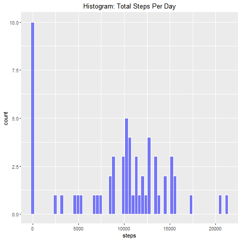
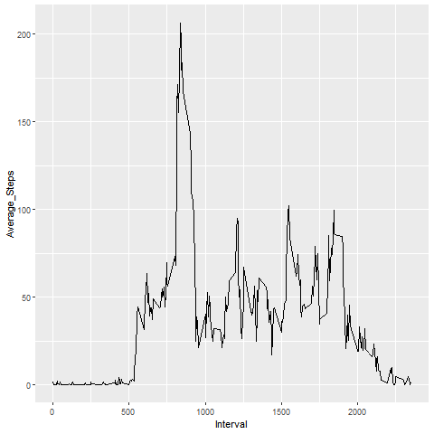
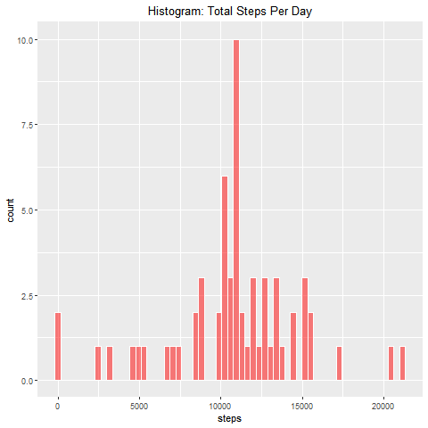

# Course Project 1 - Reproducible Research
##### Author: Tony Symonds
##### Date: 12/31/2022


## Loading and preprocessing the data

#### Import provided dataset

```{r}
activity_data <- read.csv("activity.csv", sep=",",header = TRUE)
```

#### Convert Date using lubridate
```{r}
activity_data$date <- ymd(activity_data$date)
```

#### Explore imported data using below
```{r}
str(activity_data)
dim(activity_data)
names(activity_data)
dim(activity_data)
class(activity_data$steps)
class(activity_data$date)
class(activity_data$interval)
mean(is.na(activity_data))
summary(activity_data)
```
#### Create data frame with steps per day excluding NA values
```{r}
StepPerDay <- aggregate(activity_data['steps'], by=activity_data['date'], sum, na.rm = TRUE)
```

## What is mean/median total number of steps taken per day?

#### Get mean for above created dataframe
```{r mean}
mean(StepPerDay$steps, na.rm = TRUE)
```

* 9354.23

#### Get median for above created dataframe
```{r median}
median(StepPerDay$steps, na.rm = TRUE)
```

* 10395

#### Plot histogram for data frame Steps Per Day
```{r}
ggplot(StepPerDay, aes(x=steps)) + geom_histogram(bins=61, color="white", fill="blue", alpha=0.5)+
ggtitle("Histogram: Total Steps Per Day") + theme(plot.title = element_text(hjust = 0.5))
```

 

## What is the average daily activity pattern?

#### Replicate dataframe and remove NA values
```{r}
activity_data2 <- na.omit(activity_data)
```

#### Create data frame with average steps per interval with above data frame
```{r}
AveragebyInterval <- aggregate(activity_data2$steps, by=list(activity_data2$interval), FUN=mean)
colnames(AveragebyInterval) <- c('Interval', 'Average_Steps')
```

#### Create line plot with Average per interval Data frame
```{r}
 
ggplot(AveragebyInterval) + geom_line(mapping = aes(x = Interval, y = Average_Steps))
```

 

#### Get interval with most steps
```{r}
AveragebyInterval[which.max(AveragebyInterval$Average_Steps),]
```

* Interval 835: Average Steps 206.1698


## Imputing missing values

#### Get number of records with NA value for steps values

```{r}
nrow(activity_data) - nrow(activity_data2)
```

* 2304 records with NA values


#### Create data frame of records with NA value for steps

```{r}
newdata <- setdiff(activity_data, activity_data2)
```

#### Add column with interval in minutes for this dataframe - will be used for processing.

```{r}
newdata$minutes = seq(0, by = 5, length.out = 288)
```

#### With loop add average per interval for all missing step values.

```{r}
interV = 0
cell = 1
for(i in 1:288) {
    newdata$steps[newdata$minutes == interV] <- AveragebyInterval$Average_Steps[cell]
    interV = interV + 5
    cell = cell + 1
}
```


#### Remove previously created column - no longer required.
```{r}
newdata <- subset (newdata, select = -minutes)
```

#### Combine modified data frame with avg step values with dataframe containg records with step values.

```{r}
activity_data3 <- rbind(activity_data2, newdata)
```

#### Sort new data frame by date

```{r}
activity_data3 <- dplyr::arrange(activity_data3, date)
```


#### Create data frame with average steps per interval with new  data frame
```{r}
StepPerDay2 <- aggregate(activity_data3['steps'], by=activity_data3['date'], sum, na.rm = TRUE)
```

#### Get mean for above created dataframe
```{r}
mean(StepPerDay2$steps)
```

* 10766.19

#### Get median for above created dataframe
```{r}
median(StepPerDay2$steps)
```
* 10766.19

#### Mean and median are higher than mean/median when remoiving NA values.

### Plot histogram with newly created/cleaned dataframe
```{r}
ggplot(StepPerDay2, aes(x=steps)) + geom_histogram(bins=61, color="white", fill="red", alpha=0.5)+
    ggtitle("Histogram: Total Steps Per Day") + theme(plot.title = element_text(hjust = 0.5))
```

 


#### There is a higher freguency of data near median than histogram with NA values removed

## Are there differences in activity patterns between weekdays and weekends?

#### Add column to data frame that specifies day of week for each record
```{r}
activity_data3$day_of_week <- wday(activity_data3$date)    
```


#### Create 2 separate data frames for weekdays and weekend

```{r}
WeekdaysD <- filter(activity_data3, day_of_week != 7 & day_of_week != 1)
WeekendD <- filter(activity_data3, day_of_week == 1 | day_of_week == 7)
```


#### Get average for each interval for both weekend and weekday data frames

```{r}
AveragebyIntervalWD <- aggregate(WeekdaysD$steps, by=list(WeekdaysD$interval), FUN=mean)
colnames(AveragebyIntervalWD) <- c('Interval','Avg_Steps')
```

```{r}
AveragebyIntervalWE <- aggregate(WeekendD$steps, by=list(WeekendD$interval), FUN=mean)
colnames(AveragebyIntervalWE) <- c('Interval','Avg_Steps')
```

#### Plot average steps per interval for weekend and weekday data frames

```{r}
par(mfrow=c(2,1))
plotA <- with(AveragebyIntervalWD, plot(AveragebyIntervalWD$Interval, AveragebyIntervalWD$Avg_Steps, main = "Avg Steps: Weekdays", type="l",
                                        xlab="Interval", ylab="Steps", ylim=c(0,200)))
                                        
                                        
plotB <- with(AveragebyIntervalWE, plot(AveragebyIntervalWE$Interval, AveragebyIntervalWE$Avg_Steps, main = "Avg Steps: Weekends", type="l", 
                                        xlab="Interval", ylab="Steps", ylim=c(0,200)))
```
 \

#### Average amount of steps increases on weekends
